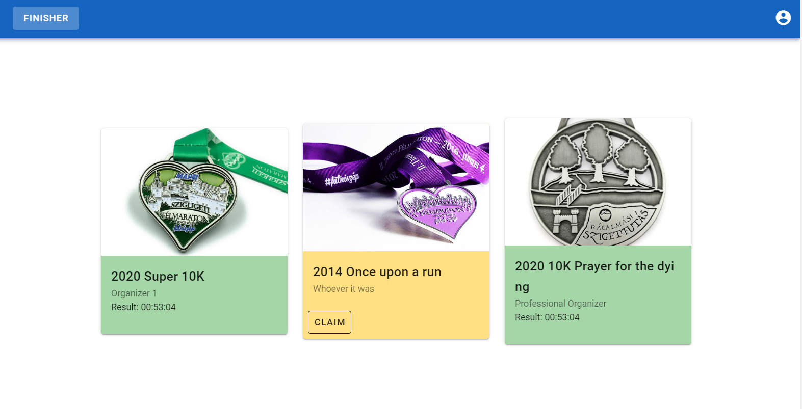
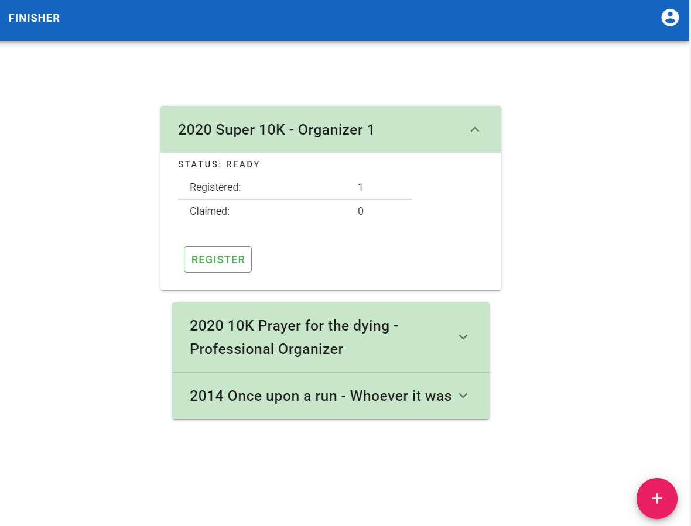

# finisher

## Collect your finishing medals and validated results on blockchain



The flow is easy.
The organizer:
- Creates the event and the medal in Finisher, and chooses the oracle that can retrieve the results
- Submits the medal to the blockchain
- Registers the competitors with their wallet and attributes that are needed to retrieve results (manually or with an API)



The competitor:
- When the results are ready the competitor can claim the medal for a fee that covers the following: the transaction checks with the oracle the eligibility and the result, and stores the achievement onchain
- (It will be possible to add off-chain metadata and references later)

[PoC as it is, without any commitments or guarantee](https://finisher-e976e.web.app/)

## Project setup
```
npm install 
```
In the main and the functions directory.

### Compiles and hot-reloads for development
```
npm run serve
```
and Truffle


### Compiles and minifies for production
```
Deploy to the chosen network
```
npm run build
```
firebase deploy
```


### Lints and fixes files
```
npm run lint
```
